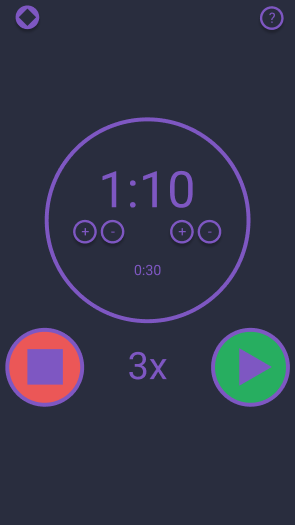

Yesterday we put some nice work into our Interval webApp!

### What have we done so far?
We added styling and made our app look much nicer! We also added the ability to input minutes along with seconds.

If you want a look at the code we worked on, [here's the repo.](https://github.com/Ecleptic/Interval-Timer/tree/e502e68c7b3a6ac3f14f29872577713285bc6d00)

---
### What's next?
Next we need to add our rest time and number of times to repeat.
We will format it to look similar to this: 

We still need to add:
* A start button
* A stop Button
* Input for rest time
* Input for number of repetitions
* A help button
* A theme-change button
* Connectivity to the +/- buttons
* sound on finish and ticking down to 0

We also need to make our little webpage into a **Progressive Web App**. To do this, we need to add a few pieces:
* Service Worker
* Page Manifest
* A set of scaled image icons for mobile apps.​
* Saving theme info and all input changes into local storage.

We will do as much of this as we can tomorrow and I hope you will join me!

Thanks for listening to me squawk about code!