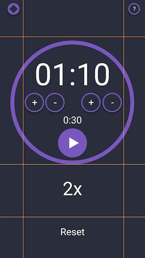

I have learned many things so far in 2018. How specifically compilers work, how to program lexical analyzers and syntax analysis, process scheduling for CPUs, reallocating and moving multiple stacks in one data set, and most importantly for this audience, how difficult it is to stream and produce quality content while finishing my last semesters of college with a job.

It has been almost a month since my last video and stream but I haven't been idle.

In the last stream we learned that there really was no need for a stop button and a start button. We might need a way to reset, however a stop button isn't necessary. So I have rebuilt the prototype.


I realized that our original layout in flexbox wasn't going to be optimal for what I had in mind. If you take a look at our new prototype, we have very specific areas for our image. There are two buttons tied to the top right and top left. The main info in the center and top of the page, the reps in the bottom center, and the reset button below that. So we want something a little more static.

We need a grid for our layout.



> Thankfully, we have css-grid.

I have been doing a lot of research on css-grid, I watched some stuff by [LevelUpTuts](https://www.leveluptutorials.com/tutorials/modern-css-layouts), [Wes Bos](https://cssgrid.io/), and of course our trusty friends at [CSS-Tricks](https://css-tricks.com/snippets/css/complete-guide-grid/).

After all this research and learning, I've decided to rebuild the layout of our _interval timer_ with css-grid.

Today I'll give you a little snippet of how we will build our grid in the next video.

The basic HTML framework for our app will appear like this:

```html
<div class="pageContainer">
    <div class="themeSelector"></div>
    <div class="helpSelector"></div>
    <div class="timerContainer">
        <form class="submitTimer-form">
        </form>
    </div>
    <div class="repsControl"></div>
    <div class="resetButton"></div>
</div>
```

As you might have noticed, we have renamed our primary classes to better describe their form.
We're also attempting to follow [BEM](http://getbem.com/) a little more closely than before. Our frame consists of a container for the page containing our theme button, help button and timer container.

Our first steps will to be to setup the grid.

```css
.pageContainer {
  display: grid;
}
```

That's a simple enough step. now we need to look again at our planned grid.


<br>

It looks like we want a grid with 3 columns and 4 rows. The primary Timer div needs to take the majority of the space, while everything else can just take the remaining area. Thankfully css-grid came up with a nice way to specify that free space.
This unit is called the [`fraction unit`](https://css-tricks.com/introduction-fr-css-unit/).

A short summary of the `fraction unit` is that it computes all other assigned areas then computes the rest of the free space according to the number of fraction units. It reminds me of the flex-grow spec.

Here is how our pageContainer will look now setting up the columns and rows.

```css
.pageContainer {
  display: grid;
  grid-template-columns: 1fr 70% 1fr;
  grid-template-rows: 1fr 50% 1fr 1fr;
}
```

There are quite a few ways to assign our columns and rows, however I'm most happy with this. It is the most readable in my humble opinion.
We assign our columns to be 1 fraction wide, then 70% of the page, and then the second fraction.

Our rows are setup just the same. The first row is 1 fraction, second row has 50% of the page, and the 3rd and 4th rows are taking up another fraction a piece.

You might ask why not do the math of `15% 70% 15%` instead? Primarily because we may want to change our space at a later date, and it would be easier to assign one than all the others.

Our final piece of the puzzle is the assigning and naming of our grid-areas. We can name our areas and then simply apply them to each class or id.
Just like assigning rows, there are multiple ways to assign grid-areas.

```css
.pageContainer {
  display: grid;
  grid-template-columns: 1fr 70% 1fr;
  grid-template-rows: 1fr 50% 1fr 1fr;
  grid-template-areas:
    "Theme  .       Help"
    ".      Main    ."
    ".      Reps    ."
    ".      Reset   .";
}
```

Above we name our 5 different areas and assign empty areas as a `"."`

We assigned our top left area as `Theme`, the top right area is called `Help`, and `Main`, `Reps`, and `Reset` are all assigned their own row in the center column.
Our last step will be assigning each div as its own grid-area. This is just as simple as you would hope.

```css
.themeSelector {
  grid-area: Theme;
}
.helpSelector {
  grid-area: Help;
}
.timerContainer {
  grid-area: Main;
}
.repsControl {
  grid-area: Reps;
}
.resetButton {
  grid-area: Reset;
}
```

<br>

### And that's it!

I was surprised that I didn't need to place quotes around the grid-area name, however it looks really clean. Now our primary layout is set! We can get back into functionally programming each piece of our app!


I'll see you guys next time! Come check out my stream at [twitch.tv/Ecleptic](https://twitch.tv/Ecleptic)!

Thanks for reading!
